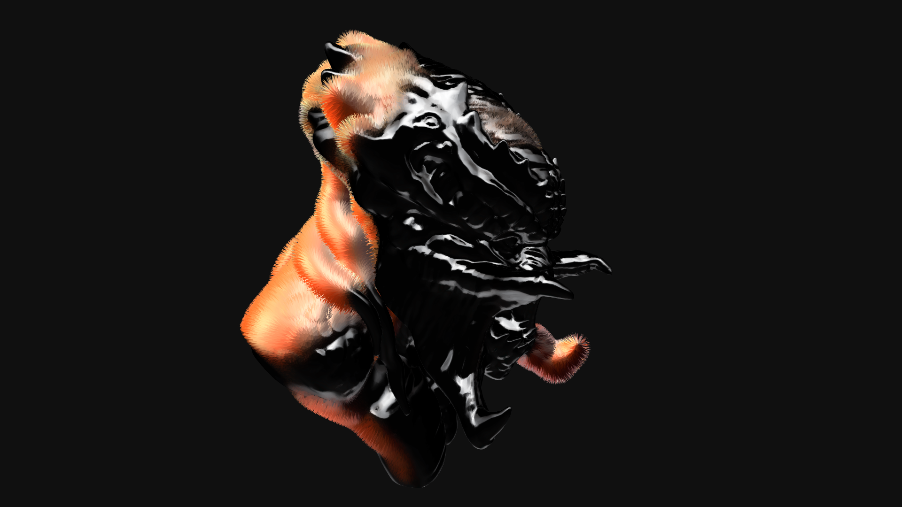
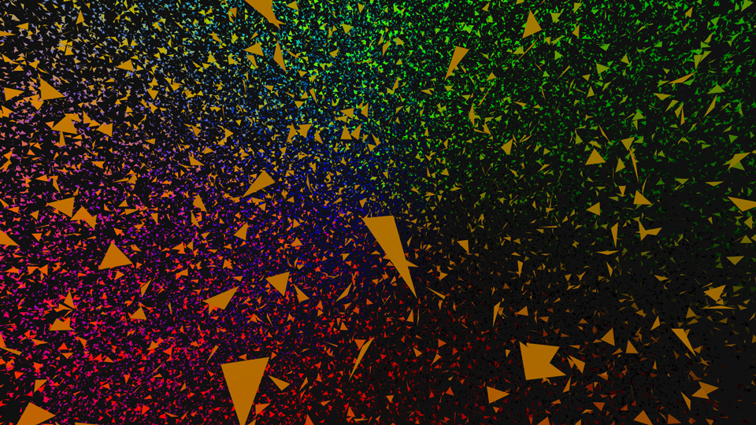

# Making a fluffy Predator


###### image of a fluffy Predator with THREE.js &amp; instanced geometry

For a recent project I had to manipulate a potentially large number of meshes. I chose to use THREE.InstancedBufferGeometry as it is very efficient ; it allows to draw the same mesh many times, with different attributes, in a single drawcall.

Working with _instances_ is slightly different from using regular meshes. In a nutshell, you give the _blueprint_ of the mesh you want to draw, adding attributes as you would with a THREE.Buffergeometry and set some special THREE.InstancedBufferAttribute that will affect each _instance_ of the _blueprint_.

If you understand the concept of _blueprint_ (the actual geometry), _instance_ (the placeholder for a _blueprint_) and InstancedBufferAttributes (the variables applied to each _instance_ of the _blueprint_), you're good to go.

The big difference with regular meshes is that instead of setting the meshes' translation/rotation/scale (TRS for short) directly on the mesh object, you have to either, manipulate all the _instances_' BufferAttributes on the CPU then re-upload them to the GPU or perform procedural transforms directly on the vertex shader.

Anyhow, a _vertex shader_ is involved to transform the _blueprint_. This may seem scary but it's not, especially as brilliant people already did most of it :)

There is a limitation when using Instances ; in WebGL, you can't pass more than 4 floats per attribute. This may not sound like much but it has a big impact on how you manipulate the meshes. You can't pass a Matrix4 (4*4 floats) to transform an _instance_. This was a surprise for me, a Matrix4 is the way meshes' store their transformations internally, it would be convenient to pass the elements of a matrix and use this matrix InstancedAttribute it to transform each _instance_ of the _blueprint_ but it is not technically feasible.

##When life gives you lemons...

Therefore, the easiest way to transform an _instance_ is to use 3 InstancedBufferAttributes to represent the TRS :

translation: a Vector3, equivalent to the mesh.position

 * rotation: a Vector4, equivalent to the mesh.quaternion (not the mesh.rotation!)
 * scale: a Vector3, equivalent to the mesh.scale
 * here's a method that instantiates count isosceles triangles and randomizes them:

here's a method that instantiates count isosceles triangles and randomizes them:

```javascript
function getInstances( count ){

    //creates an instancedBufferGeometry
    var geometry = new THREE.InstancedBufferGeometry();

    //a vertex buffer for the 'blueprint' representing a single triangle
    var blueprint = [];
    for ( var i = 0; i < 3; i++){
        var a = Math.PI / 180 * 120 * i;
        blueprint.push( Math.cos( a ), Math.sin( a ), 0 );
    }

    //assign the positions as a 'regular' BufferAttribute
    var attribute = new THREE.BufferAttribute( new Float32Array( blueprint ), 3);
    geometry.addAttribute( 'position', attribute );

    //and that's it for the 'blueprint' ; all instances will share these data
    //we can add more ; normals and uvs are very often used to shade the mesh.

    //now for the InstancedBufferAttributes, what makes each instance different.

    //we create some float buffers to store the properties of each instance
    var translation = new Float32Array( count * 3 );
    var rotation = new Float32Array( count * 4 );
    var scale = new Float32Array( count * 3 );

    //and iterators for convenience :)
    var translationIterator = 0;
    var rotationIterator = 0;
    var scaleIterator = 0;

    //and a temp quaternion (rotations are represented by Quaternions, not Eulers)
    var q = new THREE.Quaternion();

    //now let's feed some random values to transform the instances
    for ( i = 0; i < count; i++ ){

        //a random position
        translation[ translationIterator++ ] = ( Math.random() - .5 ) * 1000;
        translation[ translationIterator++ ] = ( Math.random() - .5 ) * 1000;
        translation[ translationIterator++ ] = ( Math.random() - .5 ) * 1000;

        //a random rotation

        //randomize quaternion not sure if it's how you do it but it looks random
        q.set(  ( Math.random() - .5 ) * 2,
                ( Math.random() - .5 ) * 2,
                ( Math.random() - .5 ) * 2,
                Math.random() * Math.PI );
        q.normalize();

        //assign to bufferAttribute
        rotation[ rotationIterator++ ] = q.x;
        rotation[ rotationIterator++ ] = q.y;
        rotation[ rotationIterator++ ] = q.z;
        rotation[ rotationIterator++ ] = q.w;

        //a random scale
        scale[ scaleIterator++ ] = 0.1 + ( Math.random() * 4 );
        scale[ scaleIterator++ ] = 0.1 + ( Math.random() * 4 );
        scale[ scaleIterator++ ] = 0.1 + ( Math.random() * 4 );

    }

    //create the InstancedBufferAttributes from our float buffers
    geometry.addAttribute( 'translation', new THREE.InstancedBufferAttribute( translation, 3, 1 ) );
    geometry.addAttribute( 'rotation', new THREE.InstancedBufferAttribute( rotation, 4, 1 ) );
    geometry.addAttribute( 'scale', new THREE.InstancedBufferAttribute( scale, 3, 1 ) );

    // create a material
    var material = new THREE.RawShaderMaterial( {
        vertexShader: vertexShader,
        fragmentShader: fragmentShader,
        side:THREE.DoubleSide
    } );
    return new THREE.Mesh( geometry, material );

}
```

For the vertex shader, you can do something like this (picked from the THREE examples):

```GLSL
precision highp float;
uniform mat4 modelViewMatrix;
uniform mat4 projectionMatrix;
uniform mat3 normalMatrix;

//'blueprint' attribute
attribute vec3 position;

//instance attributes
attribute vec3 translation;
attribute vec4 rotation;
attribute vec3 scale;

// transforms the 'blueprint' geometry with instance attributes
vec3 transform( inout vec3 position, vec3 T, vec4 R, vec3 S ) {
    //applies the scale
    position *= S;
    //computes the rotation where R is a (vec4) quaternion
    position += 2.0 * cross( R.xyz, cross( R.xyz, position ) + R.w * position );
    //translates the transformed 'blueprint'
    position += T;
    //return the transformed position
    return position;
}

//re-use position for shading
varying vec3 vPos;
void main() {
    //collects the 'blueprint' coordinates
    vec3 pos = position;
    //transform it
    transform( pos, translation, rotation, scale );
    //project to get the fragment position
    gl_Position = projectionMatrix * modelViewMatrix * vec4( pos, 1.0 );
    //just to render something :)
    vPos = pos;
}
```

and the fragment uses the world position as the fragment color:

```GLSL
precision highp float;
varying vec3 vPos;
void main() {
    gl_FragColor = vec4( normalize( vPos ), 1. );
}
```
With the code above, the _instances_ should be properly positioned, rotated and scaled and the mesh should look something like this (click for demo):
[](https://cdn.rawgit.com/nicoptere/FluffyPredator/6d127e33/basic.html)

You may wonder how the _instances_ can be animated, that's quite simple ; you need two sets of positions (two meshes), then create a _target_ attribute on the _blueprint_ geometry (as it will be the same target for all the _instances_) and in the vertex shader, instead of writing:

    vec3 pos = position;

you'd write :

    vec3 pos = mix( position, target, ratio );

where ratio is a value between 0 and 1. When the ratio is 0, the _instance_ is in the original position, when the ratio is 1, it is in the target position, if ratio is between 0 and 1, the values are interpolated between the 2.

The ratio can be passed as an InstancedBufferAttribute so that each _instance_ opens gradually and/or with a delay and of course, the ratio can be a noise function to get fancy animations.

It is also trivial to use a distribution object - the translation InstanceBufferAttributes are the vertices of the distribution mesh, the rotation can be computed with a lookAt().

##When life gives you affine transforms, run.

The next natural step for me was to try to cover a mesh with _instances_ of triangles so that any mesh with a triangular basis would fit nicely and wrap the distribution mesh.

The source triangle should be scaled, skewed, rotated and translated so that a single matrix can transform it into any triangle in space. Little did I know that aligning a triangle to another triangle using a transform matrix requires a special type of transform called an affine transform (I couldn't explain the difference between homothetic and affine really).

After creating a source unit triangle (like the one used in the basic demo), my algorithm went as follows for each face of the mesh:

find its center and compute its normal
transform an Object3D so that it is positioned and oriented like the face
use the inverse of the object's matrix to transform the triangle's vertices so that they lie on the 'XY' plane
multiply the object's transform matrix with the 2D affine transform (the one that aligns 2 triangles)
use this matrix to transform the _instance_
steps 1 to 3 are really straight forward ; THREE has everything you need to do this, especially as, when using an old school THREE.Geometry, you can access the object's faces' list where every Face object holds the face normal. step 4 implied finding the affine transform... After 2 days of research (and headaches), I found this great JavaScript example and after some refactoring, I ended up with this glorious piece of code:


```javascript
var alignTriangles = function( exports ){
    /**
     * find the transform matrix that aligns 3 source Vector3 to 3 destination Vector3
     * @param src array of 3 source Vector3
     * @param dst array of 3 destination Vector3
     * @returns the return matrix {THREE.Matrix4}
     */
    var object, center, normal, transform, rotation, inverse;
    function getTransform( src, dst, faceNormal ){

        //init vars if need be
        if( object === undefined ){
            object = new THREE.Object3D();
            center = new THREE.Vector3();
            normal = new THREE.Vector3();
            transform = new THREE.Matrix4();
            rotation = new THREE.Matrix4();
            inverse = new THREE.Matrix4();
        }

        //1
        // computes the face center and copies the normal
        center.set( 0,0,0 ).add(dst[0]).add(dst[1]).add(dst[2]).multiplyScalar(1/3);
        normal.copy( faceNormal );

        //2
        // positions the generic object at the center
        object.position.copy( center );
        //and make it point in the direction of the face
        object.lookAt( center.add( normal.multiplyScalar( 100 ) ) );
        object.updateMatrixWorld();

        //store this transform
        transform.copy( object.matrixWorld );

        //3
        // use the inverse of the object's matrix to transform the triangle's vertices
        inverse = inverse.getInverse(transform);
        var flat = [];
        dst.forEach(function( p ) {
            var v = p.clone().applyMatrix4(inverse);
            v.z = 0;
            flat.push(v);
        });
        //4
        // multiply the object's transform matrix with the 2D affine transform
        return transform.multiply( getTransformMatrix( rotation, src, flat ) );

    }
    function adjugate(m) {
        return [
            m[4] * m[8] - m[5] * m[7], m[2] * m[7] - m[1] * m[8], m[1] * m[5] - m[2] * m[4],
            m[5] * m[6] - m[3] * m[8], m[0] * m[8] - m[2] * m[6], m[2] * m[3] - m[0] * m[5],
            m[3] * m[7] - m[4] * m[6], m[1] * m[6] - m[0] * m[7], m[0] * m[4] - m[1] * m[3]
        ];
    }
    function multiplyMatrices(a, b) {
        var c = new Float32Array(9);
        for (var i = 0; i < 3; ++i) {
            for (var j = 0; j < 3; ++j) {
                var cij = 0;
                for (var k = 0; k < 3; ++k) {
                    cij += a[3 * i + k] * b[3 * k + j];
                }
                c[3 * i + j] = cij;
            }
        }
        return c;
    }
    function getTransformMatrix( mat, source, dest ){
        mat.identity();
        var src = [ source[0].x, source[0].y, source[1].x, source[1].y, source[2].x, source[2].y];
        var dst = [ dest[0].x, dest[0].y, dest[1].x, dest[1].y, dest[2].x, dest[2].y];
        var t = multiplyMatrices(
            [dst[0], dst[2], dst[4], dst[1], dst[3], dst[5], 1, 1, 1],
            adjugate([src[0], src[2], src[4], src[1], src[3], src[5], 1, 1, 1])
        );
        mat.elements = [t[0], t[3], 0, t[6], t[1], t[4], 0, t[7], 0, 0, 1, 0, t[2], t[5], 0, t[8]];
        return mat;
    }

    exports.getTransform = getTransform;
    return exports;
}({});
```
and to use it:
```javascript
for( i = 0; i < faces.length; i++ ){
    var f = faces[i];
    var t = alignTriangles.getTransform( vs, [vertices[f.a],vertices[f.b],vertices[f.c]], f.normal );
}
```
now _t_ contains transform from our source triangle to the current face.

I thought it would work but nope! In fact, I obtained a completely valid Matrix4 but, as we need to decompose the Matrix4 into the T,R & S components to pass them as attributes to the GPU, I suspect some data, required for the affine transform, went missing. In other words, it got schwifty and the triangles wouldn't fit.

After some further research, I found [this StackOverflow thread explaining how to pass a Matrix4 as 4 vec4](https://stackoverflow.com/questions/40100640/three-js-read-a-three-instancedbufferattribute-of-type-mat4-from-the-shader), then recompose it on the vertex shader. I followed the example and got it to work.

And there you have it: a fluffy Predator! (click for a demo)
[](https://cdn.rawgit.com/nicoptere/FluffyPredator/6d127e33/fluffy_predator.html)

On  a side note, if your mesh disappears when you zoom in, it probably gets frustrum culled, try to disable culling on the Mesh:

    mesh.frustumCulled = false;

I can think of many silly use cases for this, instanced geometry (finally) allows control over hundreds of thousands of meshes, not particles, actual meshes!